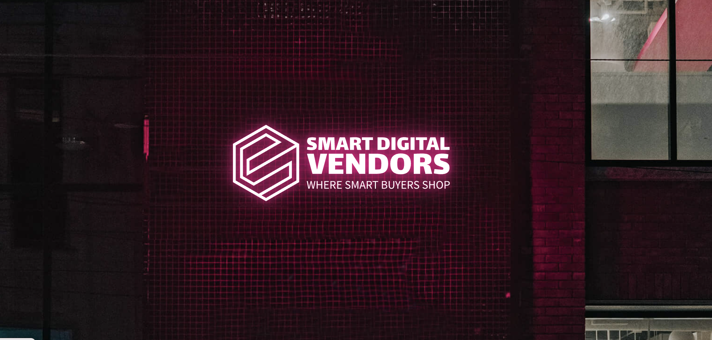

<!-- PROJECT LOGO -->
<br />
<div align="center">
<a>
   
  </a>

  <h3 align="center">Smart Digital Vendors</h3>

  <p align="center">
    This is a command line application for a smart digital vending machine that specializes in Rare Digital Products such as valuable collectible NFTS, rare vintage and special edition video games, etc.
    <br />
    <br />
    <br />
</div>


<!-- TABLE OF CONTENTS -->
<details>
  <summary>Table of Contents</summary>
  <ol>
    <li>
      <a href="#about-the-project">About The Project</a>
      <ul>
        <li><a href="#built-with">Built With</a></li>
      </ul>
    </li>
    <li>
      <a href="#getting-started">Getting Started</a>
      <ul>
        <li><a href="#prerequisites">Prerequisites</a></li>
        <li><a href="#installation">Installation</a></li>
      </ul>
    </li>
    <li><a href="#usage">Usage</a></li>
    <li><a href="#roadmap">Roadmap</a></li>
    <li><a href="#contributing">Contributing</a></li>
    <li><a href="#license">License</a></li>
    <li><a href="#contact">Contact</a></li>
    <li><a href="#acknowledgments">Acknowledgments</a></li>
  </ol>
</details>


<!-- ABOUT THE PROJECT -->
## About The Project


Welcome to the Smart Digital Vending Machine! This command line application is designed to provide a seamless and convenient way to access and purchase rare digital products. From valuable collectible NFTs to rare collectors' video games, this vending machine specializes in bringing unique and sought-after items directly to you.

Features include: <br />
Wide Range of Rare Digital Products: Explore a curated collection of valuable digital assets, including rare NFTs and exclusive video games that are highly sought after by collectors and enthusiasts.

Secure and Convenient Purchasing: The Smart Digital Vending Machine ensures a secure purchasing process, allowing you to acquire your desired digital products with ease. Purchase transactions are handled efficiently and reliably.

Intuitive Command Line Interface: With a user-friendly command line interface, navigating through the vending machine and browsing available digital products becomes effortless. Simply follow the prompts and instructions to discover, select, and purchase your desired items.

Real-Time Availability Updates: Stay informed about the availability of rare digital products. The vending machine provides real-time updates on the availability of each item, ensuring you don't miss out on the opportunity to acquire something truly special.


<p align="right">(<a href="#readme-top">back to top</a>)</p>


<!-- GETTING STARTED -->
## Getting Started

To get started with the Smart Digital Vending Machine, follow the instructions below:

### Prerequisites

Fork and clone this repository to your local machine and ensure you have the necessary dependencies installed.

### Installation

_Below is Quick guide on how you can install and setup the app._

1. Navigate to the desired directory.
2. Clone the fork the repository using the github desktop app or with the following command in your terminal:
    ```sh
    git clone [repo-URL]
    ```
3. Install NPM packages
   ```sh
   npm install
   ```
<p align="right">(<a href="#readme-top">back to top</a>)</p>


<!-- USAGE EXAMPLES -->
## Usage

Launch the Application: Open your command line interface and navigate to the project directory. Execute the command to launch the Smart Digital Vending Machine application.

Explore the Catalog: Browse through the available rare digital products by following the prompts provided by the command line interface. Take your time to discover the unique items on offer.

Select and Purchase: Once you've found a digital product you'd like to acquire, simply follow the instructions to select the item and proceed with the purchase. The vending machine will guide you through the secure transaction process.

Enjoy Your Digital Treasure: After a successful purchase, the vending machine will deliver your rare digital product to your specified location. Enjoy your newly acquired digital treasure and cherish the uniqueness it brings!

<p align="right">(<a href="#readme-top">back to top</a>)</p>


<!-- CONTRIBUTING -->
## Contributing

Any contributions you make are **greatly appreciated**.

If you have a suggestion that would make this better, please fork the repo and create a pull request. 

1. Fork the Project
2. Create your Feature 
3. Commit your Changes (`git commit -m 'Add new Feature'`)
4. Push to the Branch (`git push`)
5. Open a Pull Request

<p align="right">(<a href="#readme-top">back to top</a>)</p>


<!-- LICENSE -->
## License

Distributed under the MIT License. See `LICENSE.txt` for more information.

<p align="right">(<a href="#readme-top">back to top</a>)</p>


<!-- CONTACT -->
## Contact

Daniel Balhazar - danielbalthazar@pursuit.org

Project Link: [https://github.com/tru-salomon/Project-10.1-Module-2-Digital-Vendor](https://github.com/tru-salomon/Project-10.1-Module-2-Digital-Vendor)

<p align="right">(<a href="#readme-top">back to top</a>)</p>
